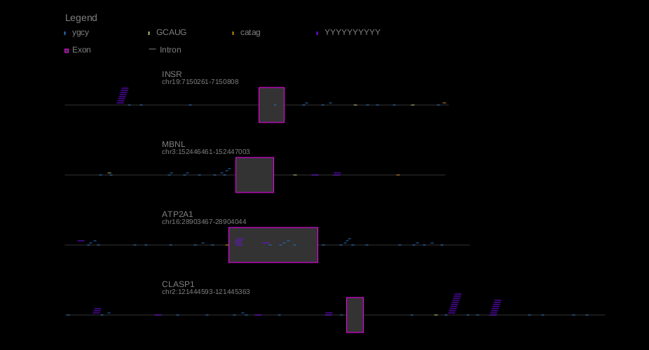

# **Motif Mark**

Motif mark generates an image of a gene, indicating locations of exons, introns, and motifs. 

Motif mark takes two files as input: a fasta file (with each sequence on a single line) and a motif file (with each motif on a single line).



## **Clone the repository**

```
git clone <repo>
```

## **Execution guide**

### **1. Consolidate fasta sequences**

Each fasta sequence must span one single line. In a typical fasta file, sequences span many lines. Convert your typical fasta file to a oneline fasta by running the following command, replacing the variables with the corresopnding values:

```
./convert_fasta.py --input_file $TYPICAL_FASTA --oneline_fasta_file $ONELINE_FASTA
```

### **2. Generate image**

Run the following command to generate your image, replacing the variables with the corresponding values:

```
./motif_mark_oop.py -f $ONELINE_FASTA -m $MOTIF_FILE
```

By default, the python script will place the image in a directory ```output/``` adjacent to the directory where the $ONELINE_FASTA is located. The default name of the image file will be the same as the $ONELINE_FASTA file, but with ```.png``` extension. 

If you wish to use an alternative output directory, specify the location using the ```-d``` flag. If you wish for the file to have an alternative name, specify the name using the ```-o``` flag.


