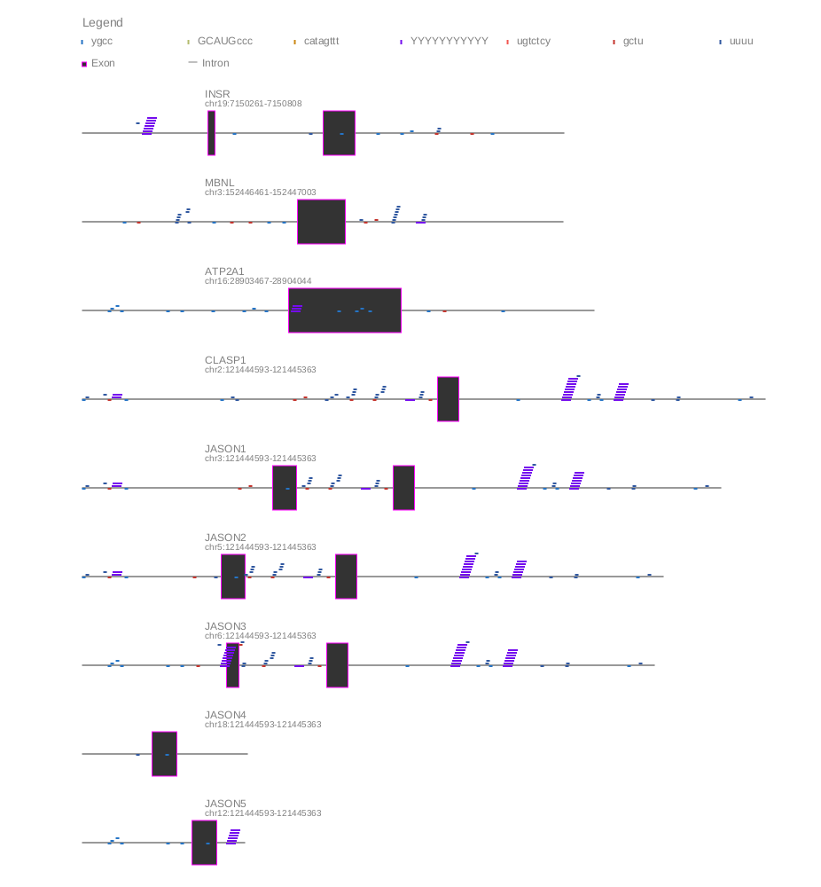

# **Motif Mark**

Motif mark generates an image of a gene, indicating locations of exons, introns, and motifs. 

Motif mark takes two files as input: a fasta file and a motif file (with each motif on a single line).



## **Clone the repository**

```
git clone <repo>
```

## **Establish conda environment**

The required dependencies for establishing a new conda environment are located in the ```environment.yml``` file. Replace $CONDA_ENV_NAME with your desired name for the motif-mark conda environemnt.

```
conda create --name $CONDA_ENV_NAME -f environment.yml
conda activate $CONDA_ENV_NAME
```

## **Execution guide**

### **1. Generate image**

Run the following command to generate your image, replacing the variables with the corresponding values:

```
./motif_mark_oop.py -f $FASTA_FILE -m $MOTIF_FILE
```

By default, the python script will place the image in a directory ```output/``` adjacent to the directory where the $FASTA_FILE is located. The default name of the image file will be the same as the $FASTA_FILE file, but with ```.png``` extension. 

If you wish to use an alternative output directory, specify the location using the ```-d``` flag. If you wish for the file to have an alternative name, specify the name using the ```-o``` flag.


