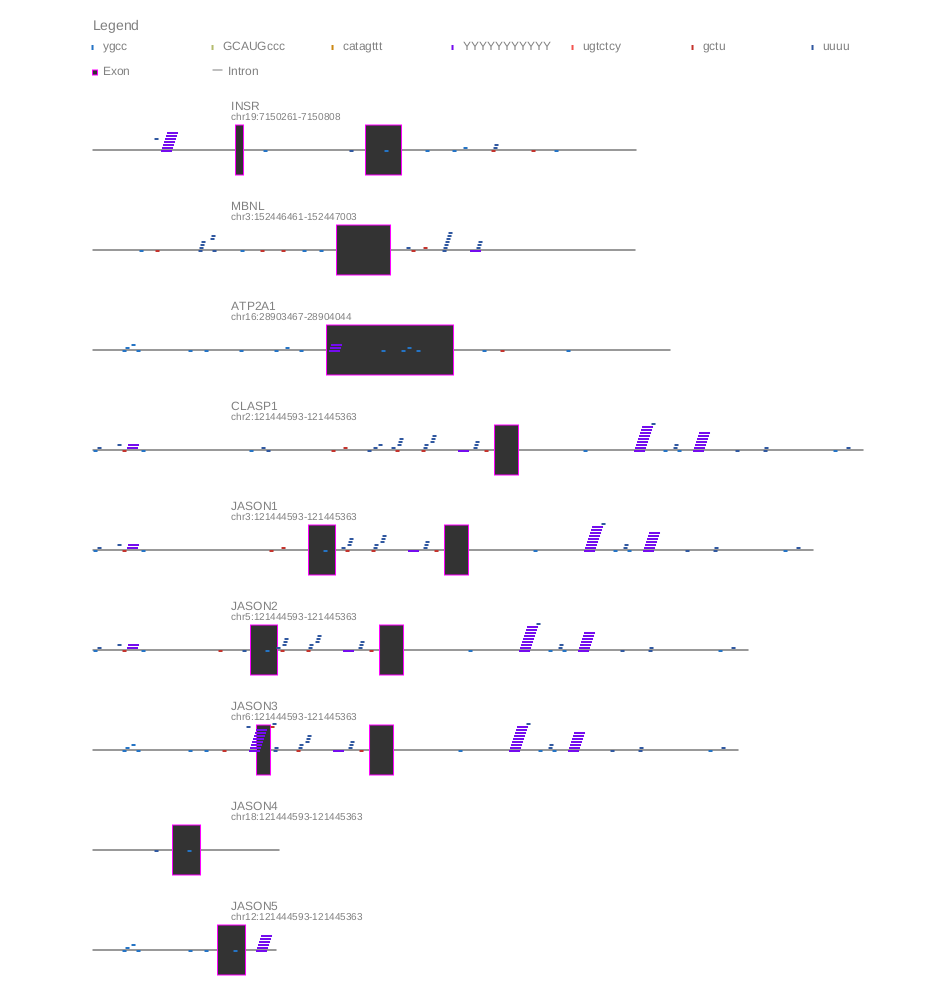

# **Motif Mark**

Motif mark generates an image of a gene, indicating locations of exons, introns, and motifs. 

Motif mark takes two files as input: a fasta file (with each sequence on a single line) and a motif file (with each motif on a single line).



## **Clone the repository**

```
git clone <repo>
```

## **Execution guide**

### **1. Generate image**

Run the following command to generate your image, replacing the variables with the corresponding values:

```
./motif_mark_oop.py -f $FASTA_FILE -m $MOTIF_FILE
```

The script will begin by converting your fasta file to a 'oneline fasta', where each sequence exists on just one line. It will leave the original fasta file intact and will create and additional file with '_oneline' insterted between the original file name and the extension.

By default, the python script will place the image in a directory ```output/``` adjacent to the directory where the $FASTA is located. The default name of the image file will be the same as the $FASTA_FILE file, but with ```.png``` extension. 

If you wish to use an alternative output directory, specify the location using the ```-d``` flag. If you wish for the file to have an alternative name, specify the name using the ```-o``` flag.


